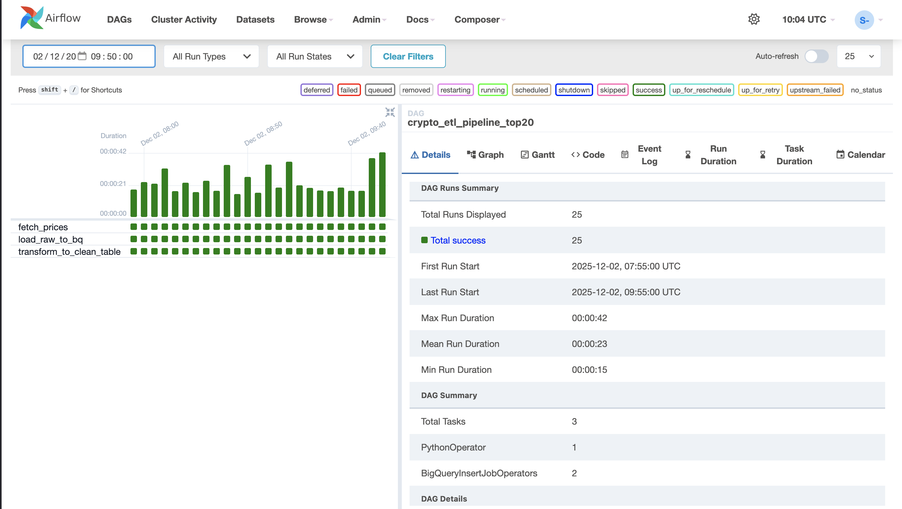
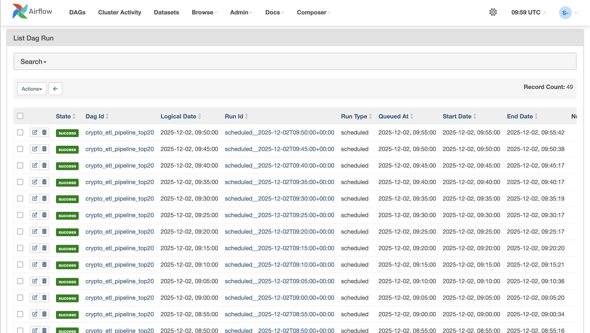
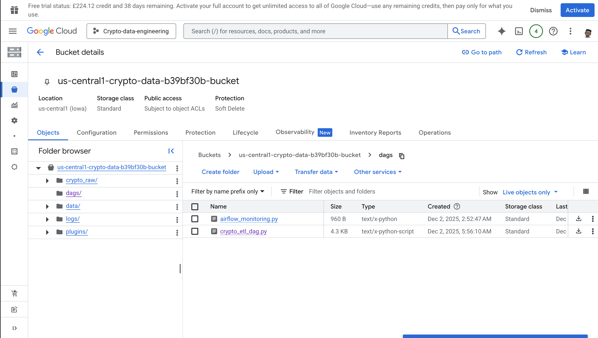
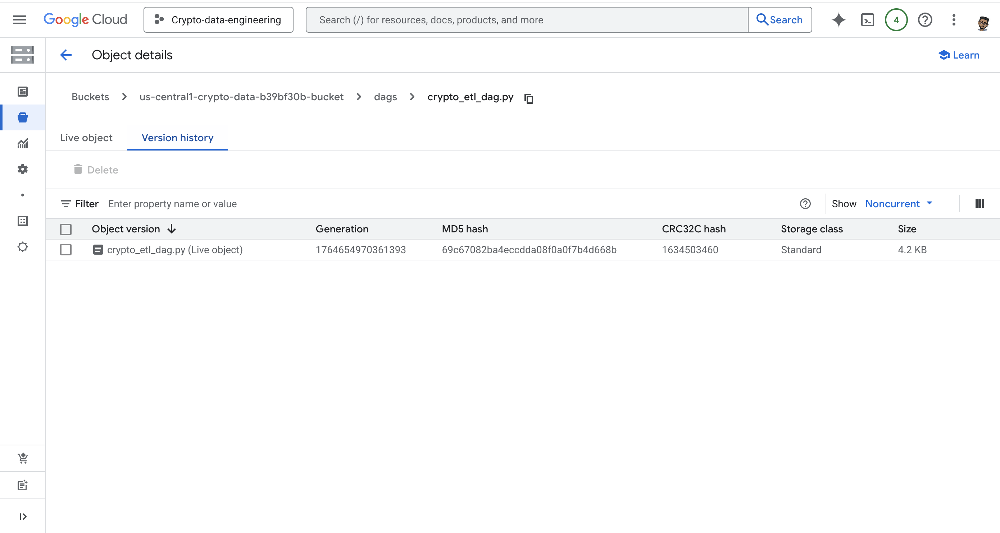
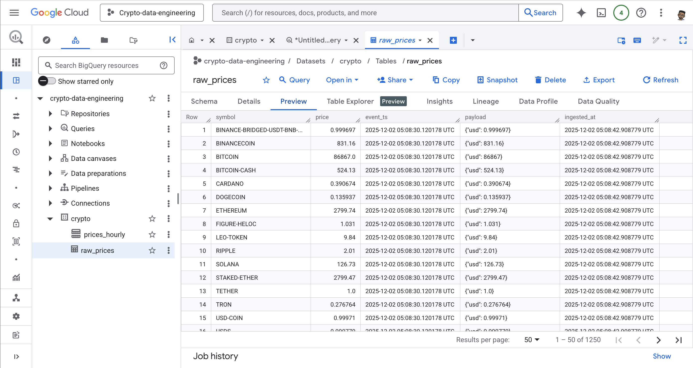
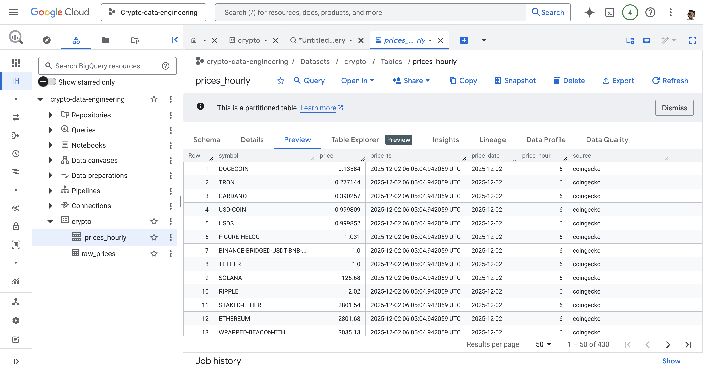

#  Crypto ETL Pipeline with Apache Airflow, GCS & BigQuery  
*A Production-Grade Cloud Data Engineering Pipeline Built on Google Cloud*

This project is a fully automated **real-time ETL pipeline** that continuously extracts live cryptocurrency prices for the **Top 20 coins**, stores raw data in **Google Cloud Storage (GCS)**, loads them into **BigQuery**, transforms them into analytics-ready tables, and finally exposes them in **Looker Studio** for real-time dashboards.

The pipeline is orchestrated end-to-end using **Cloud Composer (Managed Apache Airflow)** and runs every 5 minutes.

---

## 🧭 Architecture Overview

         ┌─────────────────────┐
         │   CoinGecko API     │
         └─────────┬───────────┘
                   │  JSON (Top 20 Coins)
                   ▼
         ┌─────────────────────┐
         │  Google Cloud Storage│
         │  (Raw Landing Zone)  │
         └─────────┬───────────┘
                   │  GCS → BigQuery Load Job
                   ▼
         ┌─────────────────────┐
         │   BigQuery Raw Table │
         │    crypto.raw_prices │
         └─────────┬───────────┘
                   │  SQL MERGE Transform
                   ▼
         ┌─────────────────────┐
         │ BigQuery Clean Table│
         │ crypto.prices_hourly│
         └─────────┬───────────┘
                   │  Analytics Layer
                   ▼
         ┌─────────────────────┐
         │    Looker Studio    │
         │ (Dashboards/Reports)│
         └─────────────────────┘

---

## ✨ Key Features

### 🔹 Automated Real-Time Crypto Ingestion  
Fetches prices for the **Top 20 cryptocurrencies** every 5 minutes using CoinGecko's API.

### 🔹 Cloud-Orchestrated ETL with Airflow  
Cloud Composer handles scheduling, retries, logging, monitoring, and task orchestration.

### 🔹 Data Lake + Data Warehouse Architecture  
- GCS stores raw JSON files  
- BigQuery stores raw & cleaned structured tables  
- SQL transformations finalize the analytics table  

### 🔹 Analytics-Ready Reporting Layer  
Cleaned data is connected to **Looker Studio** for use by data analysts.

---

## 🧰 Tech Stack

| Layer | Technology | Purpose |
|-------|------------|---------|
| **Orchestration** | Apache Airflow (Cloud Composer) | ETL automation & scheduling |
| **Data Lake** | Google Cloud Storage | Raw JSON storage |
| **Warehouse** | Google BigQuery | Querying, transformation & analytics |
| **API Source** | CoinGecko API | Live cryptocurrency data |
| **Visualization** | Looker Studio | Dashboards for analysts |
| **Language** | Python | ETL logic (Requests, GCS Client) |

---

## 📂 Output Tables (BigQuery)

### **1️⃣ crypto.raw_prices**  
Stores raw JSON API responses + timestamps.  
Schema is autodetected from GCS.

### **2️⃣ crypto.prices_hourly**  
Analytics-ready, cleaned dataset.

| Column | Description |
|--------|-------------|
| symbol | Token name |
| price | USD price |
| price_ts | Timestamp parsed from raw event |
| price_date | Date-only column |
| price_hour | Extracted hour from timestamp |
| source | Data provider |

---

## 📸 Project Screenshots

### **1.Airflow**

### **2. GCS Bucket**

### **3. Big Query**

### **4. Looker**

